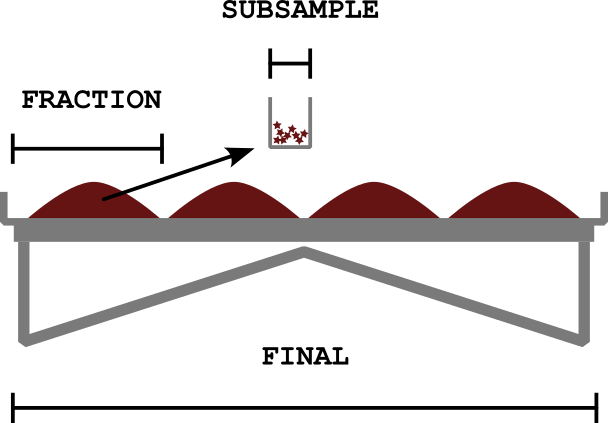

```{r, include = FALSE}
knitr::opts_chunk$set(
  collapse = TRUE,
  comment = "#>"
)
```


# Données qualitative OBIS
Une archive darwin-core (DwCA) contenant uniquement les informations d'occurrences.
La fonction `get_OBIS_archive()` produit les tables `event` et `occurrence` qui forment ensemble une archive Event-Core.

Ces deux tables sont conformes au standard DarwinCore et pourrait être importées dans OBIS via l'outil [OBIS IPT](https://obis.org/data/ipt/).
Certains colonnes doivent être remplies manuellement dans l'archive OBIS avant l'importation, comme `datasetName` et `datasetID`.

# Données quantitatives de biodiversité
La fonction `get_biodiv_data()` produit un jeu de données ayant des données quantitative (poids et dénombrement).
Un éffort a été fait pour aligner les colonnes des données avec le standard DarwinCore.
Cependant, certaines colonnes spécifiques à l'étude ont été ajoutées.
Ces derniers utiliseent des lettres majuscules pour les différencier des colonnes DarwinCore.

Les champs `eventID` (table event) et `recordNumber` (table occurence) peuvent être utilisés pour faire le lien avec les tables du DwCA OBIS.
Ces liens semi-relationnels permettent d'associer les données quantitatives aux occurrences/evenements OBIS.

# Définitions des variables.

`eventID` [Terme DwC]("http://rs.tdwg.org/dwc/terms/eventID") : L'identifiant de l'événement d'échantionnage. Ce champ est composé de `shared_models_mission.mission_number`, `shared_models_station.name` et ``shared_models_sample.sample_number``. Avec l'unique exception de l'ajout de `16F` et `16E` pour les missions pétonlce Minganie. Ce terme aparrait à la fois dans les tables DwCA OBIS et dans la table de données quantitative permettant ainsi de faire un pont (semi-relationel).

`fieldNumber` [Term DwC](http://rs.tdwg.org/dwc/terms/fieldNumber) : Nom de la station. Ce champ à une corréspondance directe avec `shared_models_station.name` dans ANDES.

`decimalLatitude` [Terme DwC](http://rs.tdwg.org/dwc/terms/decimalLatitude) : Latitude décimale en WGS84. Ce champ calcule la moyenne `shared_models_sample.start_latitude` et `shared_models_sample.end_latitude` dans ANDES.

`decimalLongitude` [Terme DwC](http://rs.tdwg.org/dwc/terms/decimalLongitude) : Longitude décimale en WGS84. Ce champ calcule la moyenne `shared_models_sample.start_longitude` et `shared_models_sample.end_longitude` dans ANDES.

`coordinateUncertaintyInMeters` [Terme DwC](http://rs.tdwg.org/dwc/terms/coordinateUncertaintyInMeters) : Précision des coordonnées en mètres. Ce champ calcule la moitié de la distance entre les points de début et de fin du trait.

`geodeticDatum` [Terme DwC](http://rs.tdwg.org/dwc/terms/geodeticDatum) : Toujours "epsg:4326"

`footprintWKT` [Terme DwC](http://rs.tdwg.org/dwc/terms/footprintWKT) : Polygone WKT représentant l'empreinte géographique du trait. Ce champ est construit à partir des coordonnées de début et de fin du trait. Elle comprends la profondeur (en metres) en tant qu'élévation z négative, si les observations du trait `start_depth_m` et `end_depth_m` sont présentes.

`footprintSRS` [Terme DwC](http://rs.tdwg.org/dwc/terms/footprintSRS) : Toujours "epsg:4326" si `footprintWKT` est présent.

`year` [Terme DwC](http://rs.tdwg.org/dwc/terms/year) 

`country` [Terme DwC](http://rs.tdwg.org/dwc/terms/countryCode) : Toujours "Canada"

`countryCode` [Terme DwC](http://rs.tdwg.org/dwc/terms/countryCode) : Toujours "CA"

`continent`[Terme DwC](http://rs.tdwg.org/dwc/terms/continent) : Toujours "North America"

`eventType` [Terme DwC](http://rs.tdwg.org/dwc/terms/eventType) : Soit "Project" pour la mission ou "Deployment" pour un trait. Voir [termes](https://registry.gbif-uat.org/vocabulary/EventType/concepts)

`minimumDepthInMeters` [Terme DwC](http://rs.tdwg.org/dwc/terms/minimumDepthInMeters) : Ce champ à une corréspondance directe avec l'observation `min_depth_m` du trait dans ANDES.

`maximumDepthInMeters` [Terme DwC](http://rs.tdwg.org/dwc/terms/maximumDepthInMeters) : Ce champ à une corréspondance directe avec l'observation `min_depth_m` du trait dans ANDES.

`ANDES_SET` Numéro du trait selon ANDES, a ne pas confondre avec set_id. Ce champ est nécessaire car il est possible avoir plusiers traits à la même station. Ce champ à une corréspondance directe avec `shared_models_sample.sample_number` dans ANDES.

`recordNumber` [Terme DwC](http://rs.tdwg.org/dwc/terms/recordNumber) : Identification de l'occurrence dans ANDES. Ce champ à une corréspondance directe avec `shared_models_catch.id` dans ANDES. Ce terme aparrait à la fois dans la table d'occurence OBIS et dans la table de données quantitative permettant ainsi de faire un pont (semi-relationel).

`scientificName` [Terme DwC](http://rs.tdwg.org/dwc/terms/recordNumber) : Nom scientifique de l'espèce. Ce champ à une corréspondance directe avec `shared_models_referencecatch.scientific_name` dans ANDES.

`scientificNameID` Term DwC. Sous la forme `urn.lsid:marinespecies.org:taxname:xxxxxx où xxxxxx` est le `AphiaID`. Ce dernier (le `AphiaID`) ayant à une corréspondance directe avec `shared_models_referencecatch.aphia_id` dans ANDES.

`ech_congelo`: `materialEntityType` OU `preparation` on hésite entre ces deux termes darwinCore. A FAIRE!

`occurrenceRemarks` Commentaires saisies sur le terrain via l'appli Biodiversité. Ce champ à une corréspondance directe avec `shared_models_catch.notes` dans ANDES.

`eventRemarks`[terme DwC](https://dwc.tdwg.org/terms/#dwc:eventRemarks) : Commentaires saisies sur le terrain via le formulaire du trait. Ce champ à une corréspondance directe avec `shared_models_catch.notes` dans ANDES.

`language` [terme DwC](http://purl.org/dc/terms/language) : Toujours "En"

`license` [terme DwC](http://purl.org/dc/terms/license) :  Toujours "http://creativecommons.org/licenses/by/4.0/legalcode"

`rightsHolder` [terme DwC](http://purl.org/dc/terms/rightsHolder) : Toujours ""His Majesty the King in right of Canada, as represented by the Minister of Fisheries and Oceans"

`institutionID` [terme DwC](http://rs.tdwg.org/dwc/terms/institutionID) : Toujours "https://edmo.seadatanet.org/report/4160"

`institutionCode` [terme DwC](http://rs.tdwg.org/dwc/terms/institutionCode) : Toujours "IML"

`datasetName` [terme DwC](http://rs.tdwg.org/dwc/terms/datasetName) : Toujours vide, doit etre remplis manuellement.

`datasetID` [terme DwC](http://rs.tdwg.org/dwc/terms/datasetID) : Toujours vide, doit etre remplis manuellement.


## Les trois niveaux d'échantionnage

`SUBSAMPLE_COUNT` : ($N_\mathrm{subsampled}$) Dénombrement des individu prélevés pour un sous-échantillon lorsque la quantité total de cette espèce est trop importante ou impossible à compter par sa nature (exemple : éponge encroutante). Ce sous-échantillon provient souvent du tri de l'espèce, mais il peux provenir du tri totale.

`SUBSAMPLE_MASS_G` : ($M_\mathrm{subsampled}$) Poids des individu prélevés pour un sous-échantillon lorsque la quantité total de cette espèce est trop importante ou impossible à compter par sa nature (exemple : éponge encroutante). Ce sous-échantillon provient souvent du tri de l'espèce, mais il peux provenir du tri totale.

`SORTED_COUNT` : ($N_\mathrm{sorted}$) Dénombrement des individus TRIÉS d'un espèce.

`SORTED_MASS` : ($M_\mathrm{sorted}$) Poids des individus TRIÉS d'un espèce.

`FINAL_COUNT` : ($N_\mathrm{final}$) Résultat d'un calcul. Représente le dénombrement et le poids ramené à la capture totale.

`FINAL_MASS` : ($M_\mathrm{final}$) Résultat d'un calcul. Représente le poids ramené à la capture totale.

`MULTIPLICATEUR` : ($k$) Valeur utilisé pour ramener la fraction du tri de l'espèce à la capture totale.

### Définitions mathématiques

Pour une espece donné, les valeurs de dénombrement $N_\mathrm{final}$ et masse $M_\mathrm{final}$ sont calculées à partir des valeurs triées $N_\mathrm{sorted}$ et $M_\mathrm{sorted}$ comme suit:
$$
\begin{eqnarray}
N_\mathrm{final} = k N_\mathrm{sorted} \\
M_\mathrm{final} = k M_\mathrm{sorted} ,
\end{eqnarray}
$$
ou le multiplicateur $k$ est défini comme suit:
$$
k =
\begin{cases}
    1, & \text{tri de l'espece sur la capture complète} \\
    4, & \text{tri de l'espece sur le quart Biodiversité}.
\end{cases}
$$
Mais il peux avoir d'autre valeurs exceptionel selon la fraction triée.

Il arrive parfois que $N_\mathrm{sorted}$ proviennt d'une extrapolation d'un sous-échantillon $N_\mathrm{subsampled}\approx 30$ quand le dénombrement est trop fastidieux :).
Dans le cas échéant, un sous-échantillon est prélevé et dénombré, puis le dénombrement du tri est estimé comme suit:
$$
N_\mathrm{sorted} = N_\mathrm{subsampled} \frac{M_\mathrm{sorted}}{M_\mathrm{subsampled}},
$$où les masses $M_\mathrm{sorted}$ et $M_\mathrm{ech}$ sont mesurées respectivement sur le tri et le sous-échantillon.

Exceptionellement pour les relevés de concombre de mer, le dénombrement du tri est éffectué, mais c'est la masse du tri $M_\mathrm{sorted}$ qui est estimée à partir d'un sous-échantillon: 
$$
M_\mathrm{sorted} = M_\mathrm{subsampled} \frac{N_\mathrm{sorted}}{N_\mathrm{subsampled}}.
$$




## Cote d'abondance relative
Les colonnes suivantes décrivent la cote d'abondance relative assignée à chaque espèce capturée lors d'un trait.

`REL_ABUNDANCE_CODE` Code (1,2,3) pour la cote d'abondance relative. Ce champ à une corréspondance directe avec `shared_models_relativeabundancecategory.code` dans ANDES.

`REL_ABUNDANCE_DESC` Description (anglais) de la cote d'abondance relative. Ce champ à une corréspondance directe avec `shared_models_relativeabundancecategory.description_eng` dans ANDES.


| Code| Description EN                    | Description FR                      |
|-----|-----------------------------------|-------------------------------------|
|1    |Species not abundant in capture	  | Faible, <5 dans la capture totale   |
|2    |Species abundant in capture	      | Modéré, 5-49 dans la capture totale |
|3    |Species very abundant in capture	  | Élevé,  >49 dans la capture totale  |

